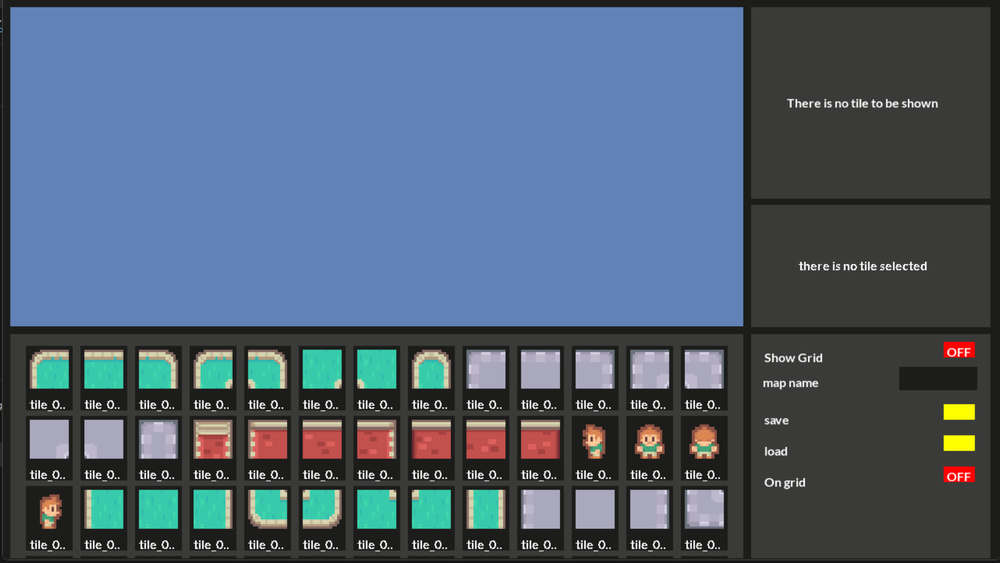
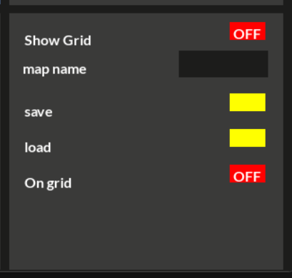
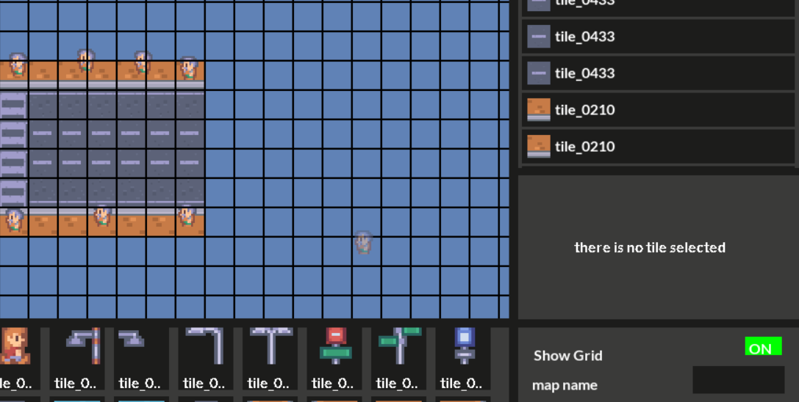
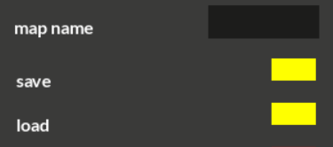
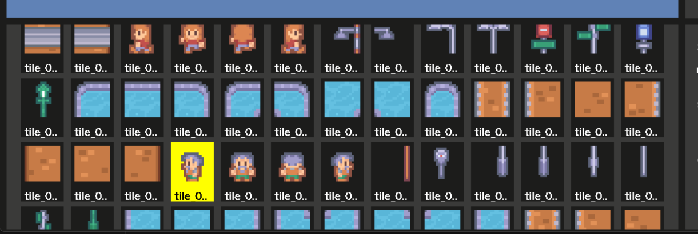
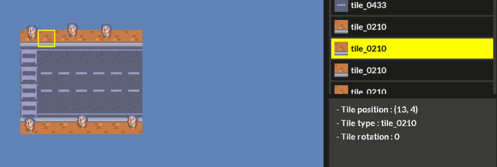
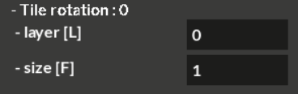

# Level Editor 🛠️
A powerful and intuitive level editor built in python & pygame for designing game levels , real-time preview, and export support. Perfect for game developers and designers.

<h3>editor</h3> 

<h3>editor settings</h3> 

<h3>show or hide the grid lines</h3> 

<h3>save and load maps by name</h3> 

<h3>but tiles on grid or off grid</h3> 

<h3>the assets in assets folder are shown in assets window! select what you want to put on</h3> 

<h3>you can select tile from the window on the top-right or from the editor window and the info of selected tile gonna be on tiles info window!</h3> 

<h3>if you selected off-grid tile you gonna see 2 more options "layer" -> to choose tile layer , "size" - > to change the size of the tile</h3> 

# Futures
-📐 Grid snapping and alignment tools for precision.

-🎚️ Customizable properties (size, rotation, layer).

-🧪 Real-time preview without leaving the editor.

-📦 Export/Import levels in JSON.

-🧩 Modular design.
